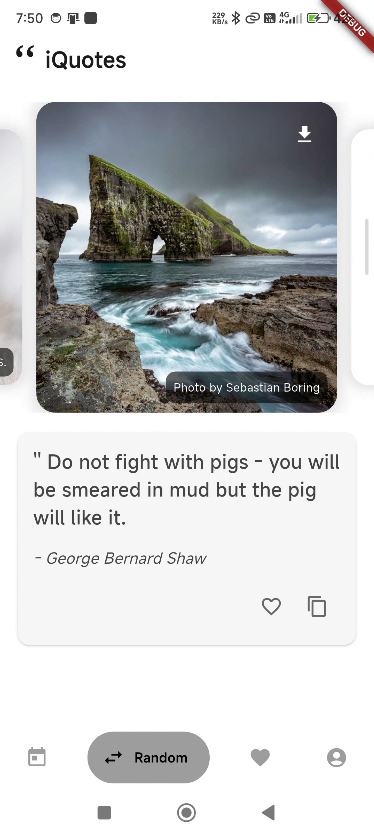
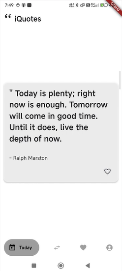
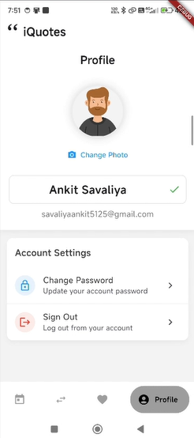

# 📱 iQuotes - A Personalized Quote App ✨

Welcome to **iQuotes**, a beautifully crafted Flutter app that delivers **daily motivation** with a touch of personalization. From discovering quotes to managing your profile, this app offers a seamless and inspiring user experience.




---

## 🚀 Features

- 🎯 **Random Quote Section**
  - Fetches quotes from [ZenQuotes API](https://zenquotes.io)
  - Shows fresh inspiration every time you open the app

- ❤️ **Like/Unlike Quotes**
  - Save your favorite quotes with a single tap
  - Data stored securely in Firestore under your profile
  - Unique quote-author keys using base64 encoding

- 🖼️ **Image Carousel**
  - Smooth sliding background images to match the vibe
  - Enhances the quote-viewing experience

- 🔐 **Firebase Authentication**
  - User login and registration
  - Secure access to your personalized data

- 📁 **Liked Quotes Screen**
  - View all your favorited quotes in one place
  - Manage and unlike quotes if needed

- 👤 **Profile Management**
  - Change display name
  - Update password
  - Upload/change profile picture

- 📥 **Download Images**
  - Save beautiful quote images to your device
  - Use them as wallpapers or share them with friends

---

## 🛠️ Tech Stack

- **Flutter** – UI development
- **Firebase Authentication** – User login/signup
- **Cloud Firestore** – Realtime database for storing user likes
- **REST API** – [ZenQuotes.io](https://zenquotes.io)
- **Base64 Encoding** – Unique key handling for saving quotes

---

## 🎬 Demo

Watch the app in action:

📺 **Video Walkthrough:**  
[Paste LinkedIn post URL here]

---

## 📸 Screenshots

| Home Screen | Liked Quotes | Profile Management |
|-------------|--------------|--------------------|
|  |  |  |

> You can update the above image paths with your actual screenshots located in the `assets/screens` folder.

---

## 🧑‍💻 Getting Started

To run this project locally:

1. **Clone the repository**
   ```bash
   git clone https://github.com/your-username/iquotes_new_version.git
   cd iquotes_new_version
